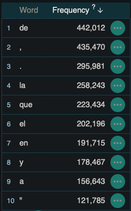

# How and Why I Created my own Spanish-to-English Dictionary

### Why
It may be hard to believe, but there are surprisingly few Spanish-English raw dictionary files or database dumps to be found on the internet. I dare you to try. Most likely it’s because lack of demand. I mean, if a Spanish word needs to be translated, a person just pops it into Google Translate or Wordreference.com and their need is fulfilled. That’s as far as the average person goes. 

But if you’re a programmer like myself, you may need a raw file of Spanish words and their English equivalents because you’re building a translation app that needs to be able to break down a single Spanish word, out of context, and get its meaning as quickly as possible without doing thousands of API calls.  And you want modern, relevant words that native Spanish-speakers actually use.

There were a small handful of Spanish lists and files that I did find online. But the problem was their content. I didn’t like them for several reasons:

* Quality: I couldn’t validate the quality of the words or definitions. As a Spanish speaker, many of the words I observed in these lists seemed off or outdated (maybe hence why they are freely available because they are gotten from old products with expired licensing?). I didn’t want a bunch of junk words. 
* Relevancy: Ties into the above. Are the words extremely outdated? Are they real words but just never actually used? Are they used by modern speakers? I randomly selected some words from the word lists and pasted them into Wordreference.com and it was unable to give me definitions for many of them in the “big” word lists (mentioned below). 
* Formatting: some of the lists were missing accent marks, or had weird characters in place of other letters (I had the correct tools and formatting of the files to adequately read them). 
* Parts-of-speech: Some of the lists had verbs only.

### Sources I Came Across
#### This post :
https://languagelearning.stackexchange.com/questions/2916/spanish-english-downloadable-dictionary

#### The best one I found:
[Spanish words and English translations] Word format in XML though, but not a dealbreaker. Otherwise, not a bad list. Would have used this one if I did not compile my own. Future plans to maybe implement these translations into my current dictionary
https://github.com/mananoreboton/en-es-en-Dic

#### A massive list of 636k Spanish words:
[Wordlist only] This didn’t seem reliable. Many of the words were unknown to me or online translators. The Github labels this file itself as “Experimental Español”. 
https://github.com/lorenbrichter/Words

#### Same as the above, just a JSON array: 
[Wordlist only]
https://github.com/words/an-array-of-spanish-words

#### A verb only database:
https://github.com/ghidinelli/fred-jehle-spanish-verbs

#### Dicts.info:
I downloaded some of the files and they were pretty horrible. I only have access to a limited version since I am not a contributor on the project. The formatting was bad. Word quality also seemed pretty poor and not well maintained.
https://www.dicts.info/uddl.php

#### A decent wordlist of 74k words
[Wordlist only] I’m hesitant on the quality of these words. The text also had bad formatting and weird accent marks. Also had some random special chars thrown in the words that that was ambiguous (the same character would sometimes be in place of an “a”, other times an “e”, “i, “o”, “u”, so I couldn’t just make a simple logic rule to replace char with a certain vowel in my code)
https://github.com/xavier-hernandez/spanish-wordlist

#### Similar to the above. A wordlist of 87k words:
[Wordlist only] I’m hesitant about the quality and relevancy of these words.
https://github.com/ManiacDC/TypingAid/blob/master/Wordlists/Wordlist%20Spanish.txt

#### Cool, but very limited and just a word list:
https://github.com/neongreen13/common-Spanish-words

The entire dump of wiktionary could be downloaded, but I thought I might get lots of junk in there too:
https://en.wiktionary.org/wiki/Help:FAQ#Downloading_Wiktionary

*Note, The [RAE](https://lingvist.com/blog/how-many-words-are-there-in-the-spanish-language/) Spanish Dictionary (THE definitive source on the Spanish language) only contains 94,000 words. So can you imagine how much junk words would be contained in those 636k wordlists? The average native Spanish speaker only knows about 20k, according to most sources I found. 

### How
1. Corpus Building: I used [Sketch Engine](https://app.sketchengine.eu)to scrape through the internet and find Spanish words. I had to feed the software certain search criteria, and then it “did its thang”. About 2.5 million words alone came from crawling through Spanish Yahoo News articles. Another 1.5 million words came from Spanish ebook files I uploaded. The other 3 millions words were just aimlessly crawling around the Spanish internet based on random seed search criteria I gave it, like: magdalena (“cupcake”), perro, familia, amor, feliz, tecnologia, filosofia, Elon Musk, etc.  After a few days of loading, I generated my own Spanish corpus of 7+ million words. These are modern, relevant, and actually used Spanish words. I can objectively confirm this. I have a "frequency" counter of how many times a certain word was encountered during the searching. Fun fact: the Spanish word "de" is by far the most used Spanish word. It came in at 442k hits. Whereas the second most used Spanish word is "la”, at about half of the usage. 

2. Data Cleansing: Once I had my word list, it was time to do some data cleansing (or “removing the fat”, as I like to call it. That’s literally my functions’ name hehe)

I built a Python program to remove the fat. I removed random characters, emojis, numbers, and non-Spanish words. To detect non-Spanish words, I used the most accurate Python library I could get my hands on: [Lingua](https://github.com/pemistahl/lingua-py).  

3. Linguistic Processing: I wanted to remove all non-infinitive verb forms, adjectives in the feminine form, and any plural nouns/adjectives for a cleaner file.  This is known as lemmatizing, and I used a library called [SpaCy](https://spacy.io) to help me achieve this. For my use case in the future, I don’t need any conjugated verbs.  When I encounter a conjugated verb, I’ll first convert it to its infinitive base form using a python library, and then match it with the lemma in my dictionary. I’ve also tagged each word with its POS (part-of-speech)
4. Translating: My Spanish words need meanings,. They needed English equivalents. So I built a function that incorporated several different APIs, that way I can get translations from different sources, compare them, remove the duplicates, and have a final result of a list of several definitions. I interfaced with Google Translate API, DeepL API, MultiDictionary API, MyMemoryTranslator API, and PonsTranslator API. Even with all that, the translations that came back were very lacking and minimal, and there were a lot of duplicates per word (as you can imagine, they all translated “muy” as “very”, for example). But in some cases it gave more variety to the translations. Since I was translating one word out of context at a time, I didn’t expect much from the translators. It was a “best effort” attempt. 

### The Python Program
The program is uploaded here in its final form. The program went through several stages of revision depending on what stage of the process I was in with this project. So this last form of the program that you see here is taking an already semi-complete CSV file and merging things together. But the project in its final form will remain here to be tweaked and modified by you to fit your own purpose.

### Setbacks
Some of the translators sucked. Particularly the MultiDictionary API. It kept giving errors and I reached  its daily limits very quickly. Google Translate API   also had very low daily limits that I exceeded quickly. DeepL and PonsTranslator were the powerhouses of this project. I also found a workaround with the Google Translate API. So instead of calling the API thousands of times and reaching the API limits before I had given it even 5% of my words, I took a CSV file with all my Spanish words and uploaded it to Google Translate website, and it gave me back the file all in English. 

### Conclusion
After parsing, lemmatizing, removing junk and non-Spanish words,  my dictionary contains a total of 49,525 entries. Before all the cleaning and lemmatizing it was 3x larger than that. That’s not to say there’s not still junk in there. A quick look will show that there’s still conjugated verbs, weird slang, and other foreign words contained in it. There is certainly improvement to be had. But at least we know we’re working with modern Spanish words that are in use. Additionally, I’ve added a field called “Prevalence” that shows a decimal value from 0 to 1 for each word. The higher the value, the more it is used currently in modern, 2023 Spanish. This way you can judge for yourself if you are using a suitable word or one that’s obsolete. 

The dictionary file is named spanish_dictionary.csv and is available to anyone. Recommend opening it in a universal CSV reader to view it properly. (I noticed Excel doesn’t do well with Spanish accent marks)

*This project was never meant to replace translators like Google Translate or other tools that harness machine learning and AI techniques. Google Translate can take into account the entire sentence and translate each word based on context from its surroundings. My dictionary doesn’t do that. It just has a single semantic chunk. My purpose had nothing to do with competing with those tools. 
